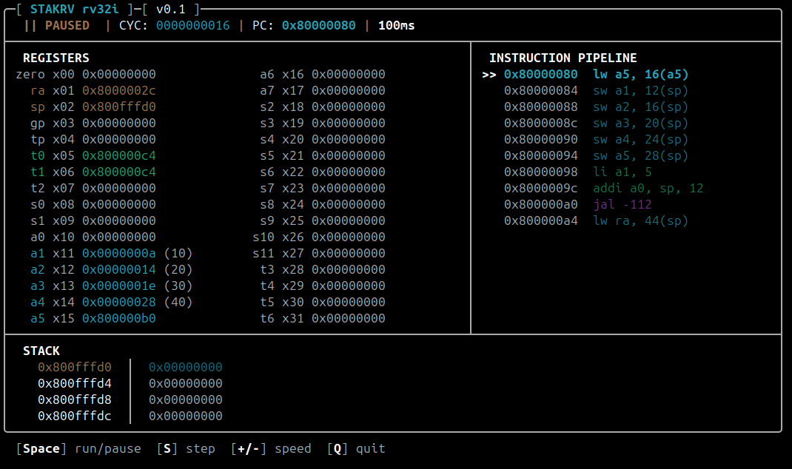

# StakRV

RV32I emulator with an interactive terminal debugger, written in C++17.



## Description

StakRV is a hobby project built to understand RISC-V. The CPU core implements the full RV32I integer ISA with a fetch-decode-execute loop, and the TUI is built directly on raw ANSI/VT100 escape codes without any external terminal library.

The debugger shows all 32 registers (with ABI names and decimal hints for small values), a disassembly lookahead window, a stack depth gauge, and per-register write highlighting - registers flash on write and a `<<` marker tracks the last destination. Instruction categories are colour-coded in both the pipeline and register panels. Execution speed is adjustable at runtime.

The goal was to build something I could actually step through RISC-V code with, and learn the ISA in the process.

## Building

Requires a C++17 compiler and CMake ≥ 3.16.

```bash
cmake -B build -DCMAKE_BUILD_TYPE=Release
cmake --build build
```

Debug build (with AddressSanitizer):

```bash
cmake -B build -DCMAKE_BUILD_TYPE=Debug
cmake --build build
```

## Usage

```
./build/stakrv <binary>
```

Accepts a flat RV32I binary (no ELF header). The image is loaded at `0x80000000` into a 1 MB address space; the stack pointer is pre-set to the top of memory.

To produce a suitable binary with the RISC-V GNU toolchain:

```bash
riscv64-unknown-elf-gcc -march=rv32i -mabi=ilp32 \
    -nostdlib -Ttext=0x80000000 -o program.elf program.s
riscv64-unknown-elf-objcopy -O binary program.elf program.bin
```

## Controls

| Key | Action |
|-----|--------|
| `Space` / `p` | Pause / resume |
| `s` | Single-step (while paused) |
| `+` | Increase Latency |
| `-` | Decrease Latency |
| `q` / `Esc` | Quit |

## Examples

The `examples/` directory has a collection of RV32I programs to try - covering
loops, recursion, sorting, string ops, and bitwise tricks. Build them all with:

```bash
cd examples && make
./build/stakrv examples/fib.bin
```

See [`examples/README.md`](examples/README.md) for the full list.

## ISA coverage

RV32I baseline - all 40 integer instructions, byte/half/word loads and stores with correct sign-extension, ECALL/EBREAK halt. RV32M (multiply/divide) is not yet implemented.

## Limitations

- Flat binary only (no ELF loader)
- No CSR or privilege levels
- No memory-mapped I/O
- Terminal must be at least 106 × 28 characters